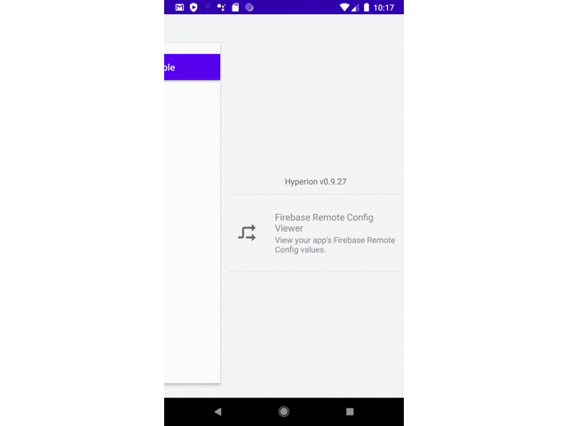
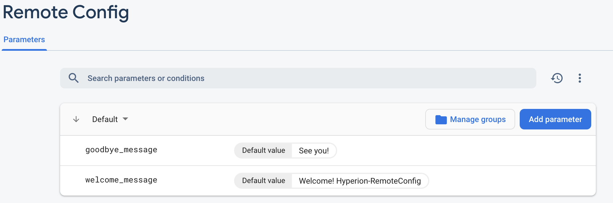

# hyperion-firebase-remote-config
[  ](https://bintray.com/k-tomoyasu/maven/hyperion-firebase-remote-config/_latestVersion)  
[hyperion](https://github.com/willowtreeapps/Hyperion-Android) plugin to show [Firebase Remote Config](https://firebase.google.com/docs/remote-config/) key-values.

## ScreenShots
### viewer

### firebase console


## Installation
Add to build.gradle
```groovy
dependencies {
    debugImplementation "com.willowtreeapps.hyperion:hyperion-core:$hyperion_version"
    debugImplementation "com.fusuma:hyperion-firebase-remote-config:$plugin_version"
}
```

## License
MIT